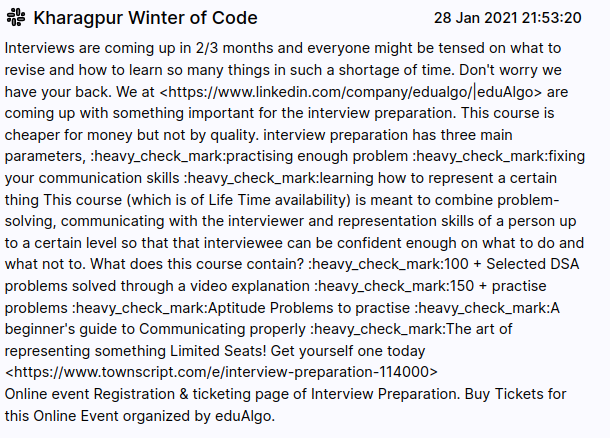
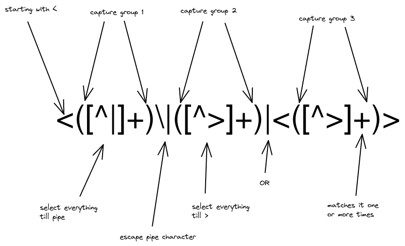
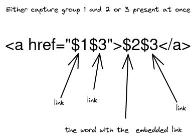
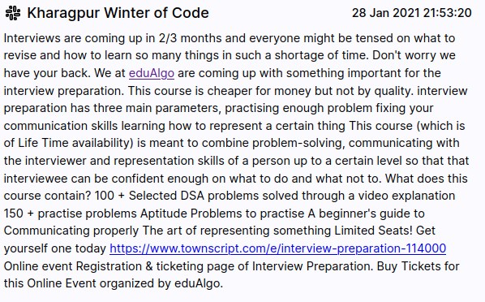

+++
title = "Day-1, Using RegEx to fix Slack API response"
date = 2021-07-31
+++

Just a few days ago I worked on a search plugin for Neera which would let an user search across multiple public slack workspaces.

This solved two problems:

- One doesn't have to know about a Slack workspace to search through it
- One can search across multiple workspaces concurrently

We ([Raghav](https://rakaar.github.io/) and I) used Slack's search API after an app was added to that workspace. This post contains how I improved the Slack API response before rendering.

# What's the problem exactly?

This is an example of how a single match looks like in the response of the Slack Search API, I removed the parts I didn't need to keep this blog small:

```json
[
  {
    "type": "message",
    "ts": "1611851000.000300",
    "blocks": [
      {
        "type": "rich_text",
        "block_id": "rANHC",
        "elements": [
          {
            "type": "rich_text_section",
            "elements": [
              {
                "type": "text",
                "text": "Interviews are coming up in 2/3 months and everyone might be tensed on what to revise and how to learn so many things in such a shortage of time.\n\nDon't worry we have your back. We at "
              },
              {
                "type": "link",
                "url": "https://www.linkedin.com/company/edualgo/",
                "text": "eduAlgo"
              },
              ....
              { "type": "emoji", "name": "heavy_check_mark" },
              {
                "type": "text",
                "text": "The art of representing something\n\nLimited Seats! Get yourself one today\n"
              },
            ]
          }
        ]
      }
    ],
    "text": "Interviews are coming up in 2/3 months and everyone might be tensed on what to revise and how to learn so many things in such a shortage of time.\n\nDon't worry we have your back. We at <https://www.linkedin.com/company/edualgo/|eduAlgo> are coming up with something important for the interview preparation. This course is cheaper for money but not by quality.\n\ninterview preparation has three main parameters,\n:heavy_check_mark:practising enough problem\n:heavy_check_mark:fixing your communication skills\n:heavy_check_mark:learning how to represent a certain thing\n\nThis course (which is of Life Time availability) is meant to combine problem-solving, communicating with the interviewer and representation skills of a person up to a certain level so that that interviewee can be confident enough on what to do and what not to.\n\nWhat does this course contain?\n:heavy_check_mark:100 + Selected DSA problems solved through a video explanation\n:heavy_check_mark:150 + practise problems\n:heavy_check_mark:Aptitude Problems to practise\n:heavy_check_mark:A beginner's guide to Communicating properly\n:heavy_check_mark:The art of representing something\n\nLimited Seats! Get yourself one today\n<https://www.townscript.com/e/interview-preparation-114000>",
    "permalink": "https://kwoc-koss.slack.com/archives/CQ8MLJ4TD/p1611851000000300",
    "no_reactions": true,
    "slack_name": "Kharagpur Winter of Code"
  }
]
```

I am concerned with just the `text` and `permalink` for now, because all I want is to show the message and take someone to that message on click.
I did the following without putting much thought:

```tsx
<a href={item.permalink} rel="noreferrer nooepener">
  {item.text}
</a>
```

This is how it looked which brought light to the two of the major issues with using `text` directly



- Words with embedded links had word after a pipe:

```text
 <https://www.linkedin.com/company/edualgo/|eduAlgo>
```

- Plain Links were in angle brackets but without the pipe
- Emojis had to removed too, they were present by their name `:heavy_check_mark:`

# Fix how?

I was working on a timeframe, had to get this in a presentable state in an hour or two. Using RegEx to change the links into anchor tags and remove the emojis and later passing the text as innerHTML of a div seemed like the best way.

There was also an array within `blocks` named `elements` which had split the `text` into types like "text", "link" and "emoji". I could have formed the final text using that but thought it would longer and untidier than using RegEx.

# Writing RegEx substitutions

1. First step to writing RegEx (Regular Expression) is to open a RegEx tester. I like [regex101.com](https://regex101.com/).
2. Copy a sample text containing the strings you want to substitute or find. The one in the above JSON block is good as it contains both types of links and emojis.

## Let's fix the links first

Let's write both types of links and how I want them to look to work:

Before:

```text
<https://www.linkedin.com/company/edualgo/|eduAlgo>
<https://www.townscript.com/e/interview-preparation-114000>
```

After:

```html
<a href="https://www.linkedin.com/company/edualgo/"> eduAlgo </a>
<a href="https://www.townscript.com/e/interview-preparation-114000">
  https://www.townscript.com/e/interview-preparation-114000
</a>
```

Two cases:

1. With pipe

- Select everything after < till a |
- Select the rest, i.e. after | till a >

2. Or without a pipe

- Select everything between a < and >



Substitution:



## Let's remove the emojis now

Select everything between two colons that's it, right? Nope. Consider this case:

```text
... :heavy_tick_mark:This blog is getting longer than expected :heavey_tick_mark: ....
```

One can say that there are two strings "heavy_tick_mark" inside colons but there is also one string "This blog is getting longer than expected" inside two colons.

So we only want the strings inside colons **that don't contain any spaces**. I wrote this for doing the same, notice the space after ^ and before :

```ex
  /:[^ :]+:/gm
```

Now, insert the `text` into the div

```tsx
<div dangerouslySetInterHTML={{ __html: item.text }}></div>
```

# The results


