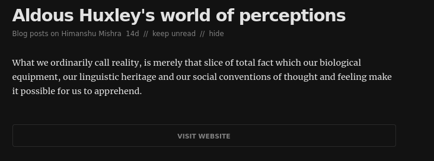
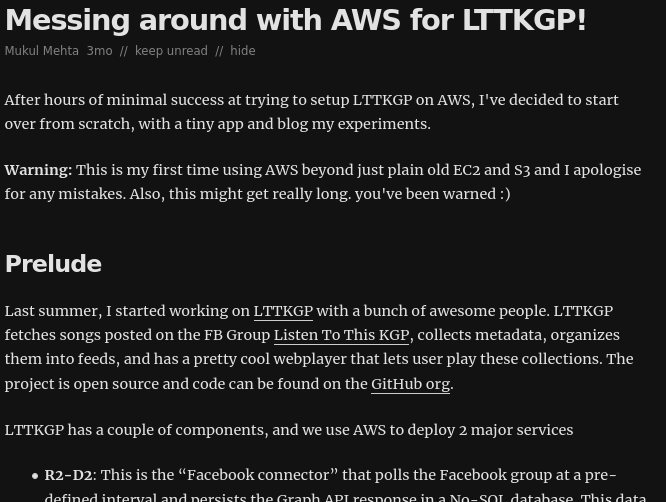

+++
title = "Day-3, Partial vs Full RSS Feeds"
date = 2021-08-02
+++

RSS is powerful. The issue with bookmarking your favourite sites is that you can't keep checking them to see if they have been updated or if have any new articles. RSS solves this issue, hence the name **R**eally **S**imple **S**yndication.

I have been using [Feedly](https://feedly.com/) for more than a week now, and RSS has enabled me to have a custom feed of articles that I made. Not something that was recommended due to it being "viral" or a program deciding based on my interests.

# One tiny issue though

I am greeted with this screen very frequently while checking my RSS reader.

What's the issue you ask? Well, I don't like the above but the one below:

I don't dislike the articles by any chance, if that's what you thought. They are very well written and that too by the people I have had the opportunity to interact with. (Link to [first](https://orkohunter.net/blog/huxleys-world-of-perceptions/) and [second](https://mukul-mehta.in/posts/aws-experiments/) article)

The issue is that I can't enjoy a centralized custom article feed if I can't read them in the same place. I don't want to move back and forth between everyone's blog and my RSS reader.

# Why the difference?

At first I noticed that the websites with full page content were using Atom (Atom Syndication Format) instead of normal RSS.

Atom was made to fix the issues with RSS specifically that with the structure that made it hard to parse data and check for updates. [This article](https://nullprogram.com/blog/2013/09/23/) does a good work to explain the ways Atom made things easier for everyone behind the scenes. But, after looking for almost 30 minutes I wasn't able to find anything related to full page content being specific to Atom.

Searching for "partial rss feeds" showed the right way I should be searching in.

# Partial vs Full Rss Feeds

Having an RSS feed with partial or full page content is a choice. Why one should choose one over the other is a matter of debate.

It's better to know the arguments of both the sides to form opinions.

## Where are your readers reading you?

The decision to whether have the full or partial page content in RSS feed depends a lot on how your readers tend to read your articles. Any user would prefer the full feed as they wouldn't have to move from site to site when checking their RSS reader.

But this isn't as easy is it seems.

- Showing the full feed would reduce the amount of people visiting your site, because why would they? This results in lesser page views and this in turn results in your website not showing in web results easily (Bad SEO).

- Having full feeds also make it easier for spam sites to copy your page content and show it on their website with a bunch of advertisements. Something similar happened with [KOSS's website](https://kossiitkgp.org/) few months ago.

  What to do in this case? You would have to spend time finding the host or/and the site owner, and write a strong worded email in hopes of the site being taken down. Not something I would like to spend my time on.

  Not only this, having multiple sites with the same content can also result in bad SEO ranking.

## What do your readers want?

As a reader myself, I find having the full page content makes things easier. At the same time, as a developer I want people to spend time on my website, appreciate the time I have put in styling it :p

Having access to full page content can result less engagement on the website, which means lesser discussions in the comments. Not something I would like.

Although I am still not so sure in the partial vs full feed debate, I am going to stick with showing the full page content for now. But one thing I know for sure is that [RSS is underrated](https://rakaar.github.io/posts/2021-07-23-use-rss/).
